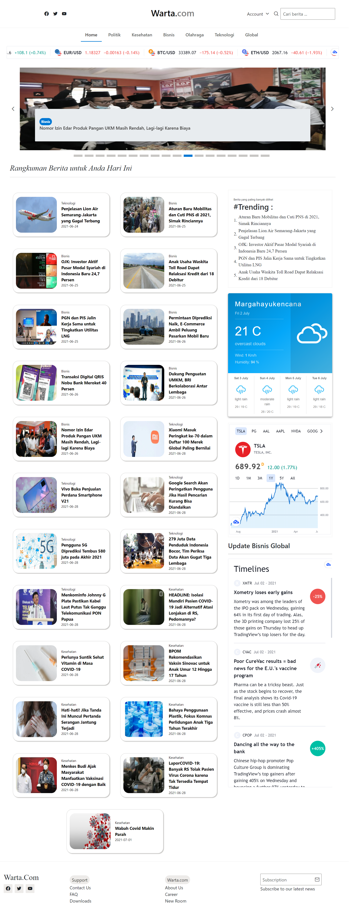
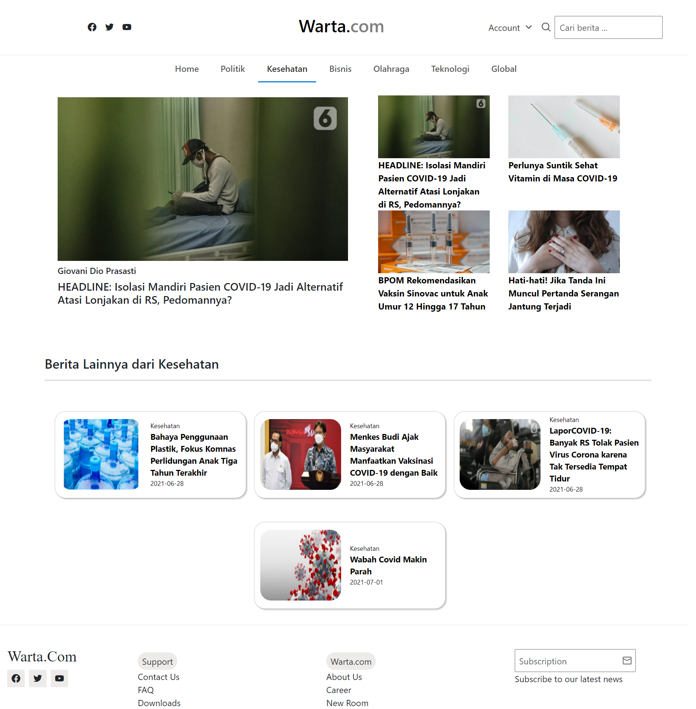
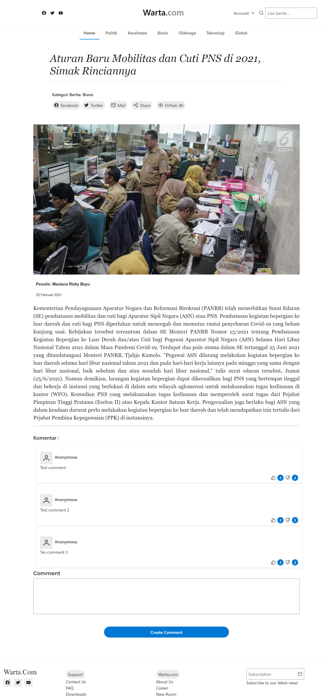

# Mini Project from Purwadhika Student : Warta
**Created by : Raden Gugi Iriandi(JCWM-BDG0005-002), Allysa Rahmagustiani(JCWM-BDG0005-006)**

**Managed by : Abdi Alghifara Felinanda(Purwadhika Mentor)**

Project ini merupakan hasil implementasi dari semua materi yang telah dipelajari oleh student untuk membuat sebuah aplikasi dibidang penyajian berita. Untuk backend repository berada di url : **https://github.com/Abdi-01/warta-api.git**

## Web Preview

### Landing Page

### News by Category

### News Detail

### User : Delivery Status

### Library Used (Front End)
- [Bootstrap](https://getbootstrap.com/docs/4.0/getting-started/introduction/) for layouting and make component.
- [Primereact](https://www.primefaces.org/primereact/) for layouting and make some component.
- [react-open-weather](https://www.npmjs.com/package/react-open-weather) for weather info.
- [react-tradingview-embed](https://www.npmjs.com/package/react-tradingview-embed) for trade info.

### Library Used (Data State Management)
- [Redux and React Redux](https://redux.js.org/) for manage data from local state and global state.
- [Axios](https://www.npmjs.com/package/axios) for get/post/put/delete data from back-end API.